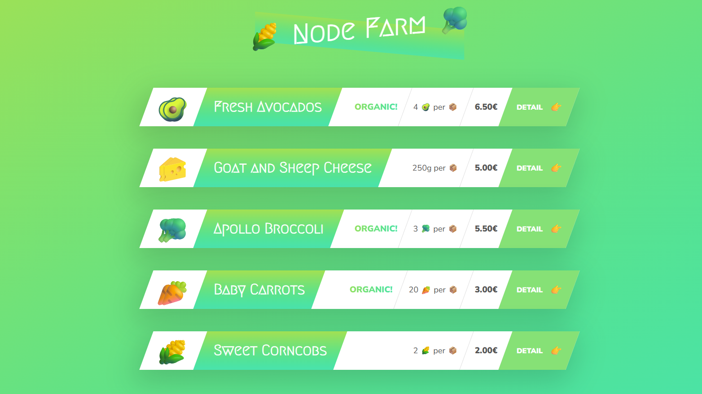

# Node Farm

Node Farm was my first Node.js app, built as a learning project to understand how a server works without a framework doing the heavy lifting for me. It is a simple product catalog for organic food items, but the main goal was to practice the Node basics: reading files, creating an HTTP server, handling routes, and rendering HTML from data.

## What I built

I built a small web app that shows a list of farm products on an overview page and a separate detail page for each product. The app also exposes the raw product data as JSON so I could see the same information in a different format. This project helped me connect the dots between backend code, templates, and browser output.

## Preview



## How it works

When the app starts, it reads the data and HTML templates from disk once, then keeps them in memory. After that, the server listens for requests and decides what to return based on the URL:

- `/` or `/overview` shows all products
- `/product?id=...` shows one product
- `/api` returns the full JSON data
- anything else shows a 404 page

The pages are generated by replacing placeholders in the HTML templates with real product values from `data.json`. I also used `slugify` to create URL-friendly product names while testing the data.

## Tools I used and why

- `fs` - I used this to read the JSON file and the HTML templates from disk. This taught me how Node can work with files directly.
- `http` - I used this to create the server from scratch instead of relying on a framework. This was the core step in understanding how requests and responses work.
- `url` - I used this to parse the request URL and query string so I could route users to the right page.
- `slugify` - I used this to turn product names into clean URL-style strings while testing the product data.
- `nodemon` - I used this so the server would restart automatically whenever I changed the code. That made learning and debugging much faster.
- `replaceTemplate` - I wrote this helper to replace placeholders like `` and `` inside the HTML templates. It showed me how to reuse a small piece of logic instead of hardcoding HTML.

## What I practiced

This project was mostly about learning the fundamentals of Node.js. I practiced synchronous file reading, basic server creation, request routing, query handling, simple templating, and organizing code into small modules. I also learned how a real app can be built from plain JavaScript, HTML templates, and data files without a framework.

## Project files

- `index.js` - the main server file
- `modules/replaceTemplate.js` - custom template helper
- `dev-data/data.json` - product data
- `templates/` - overview, product, and card HTML templates
- `txt/` - file system practice files from the learning exercises

## Run it

```bash
npm install
npm start
```

Then open `http://127.0.0.1:8000` in your browser.
